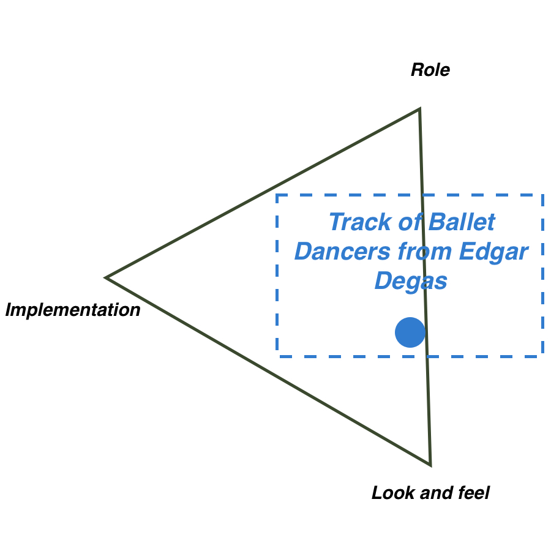

# Track of Ballet Dancers from Edgar Degas

## Inspiration

This is an exhibition prototype exclusively for exhibiting works of Edgar Degas, who is considered as a famous impressionist painter. Under the subject of ballet dancers, Degas has a series of works to depict their bodies and gestures. But more importantly, he absorbs the techniques of Ukiyo-e from Japan and apply the composition innovation in his works. Instead of centralize all characters in the middle or arrange them evenly on canvas, he guide audiences sight line positively from a start to corner, so that he can stretch the content to the outside of the canvas and leave more space for imagination. 

## Brainstorming

In this prototype, I want to augment this composition feature and present it more vividly. Only one work might be not obtrusive enough so I place his works together and combine the sight track into a long one. Then I create a dark room and only move the light source on the track to fully attract audiences attention to here. At the final part, I add a tablet to play the video of a dance room, imitating the effect of imagination stretch. 

## Prototype

I hope that I can use this exhibition prototype to help audience appreciate the works of Edgar Degas in a certain way and I also establish it basic structure, so I put it at the middle of look and feel and role.

