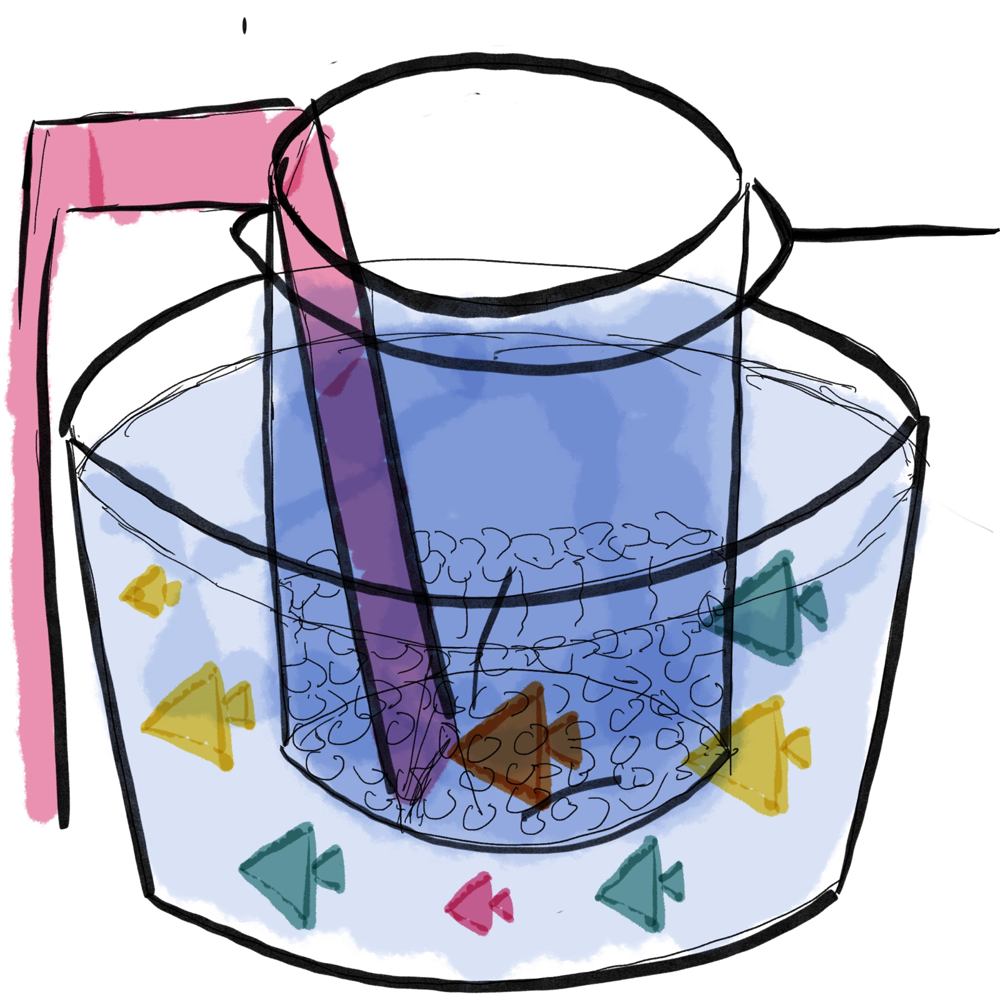
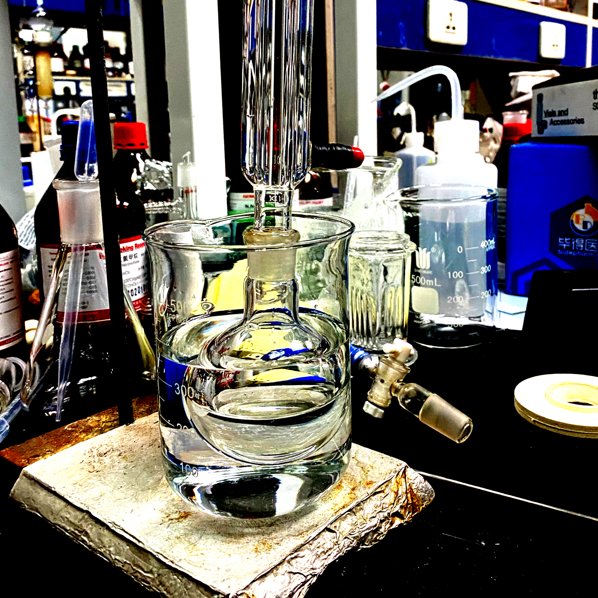

# Swimming Pool for Children

## Inspiration

This prototype can be seen as a combination of big fish tank and children swimming pool. Because the real physical contact between children and marine creature is likely to be harmful, I have always been thinking about how to balance immersion and distance. 

## Brainstorming

The children bathtub give me inspiration. Many kids have the experience of sitting in small bathtub with various toys in it. And I think just standing in front of fish tank makes children far from those creatures because they are on land and in water respectively. But letting them swim together, even they are blocked by glass. 

## Prototype

I use waterbath experiment to represent this prototype because I think the two are similar. So I mainly just want to visualize this concept and using this experiment is the most direct way.

