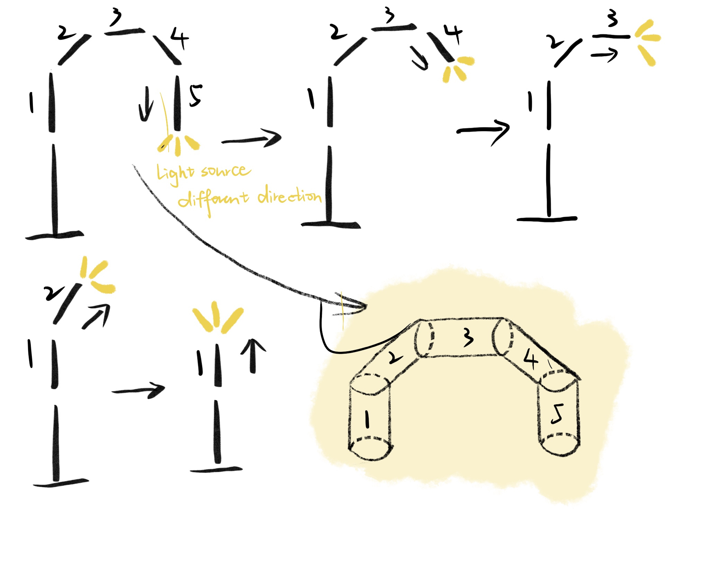
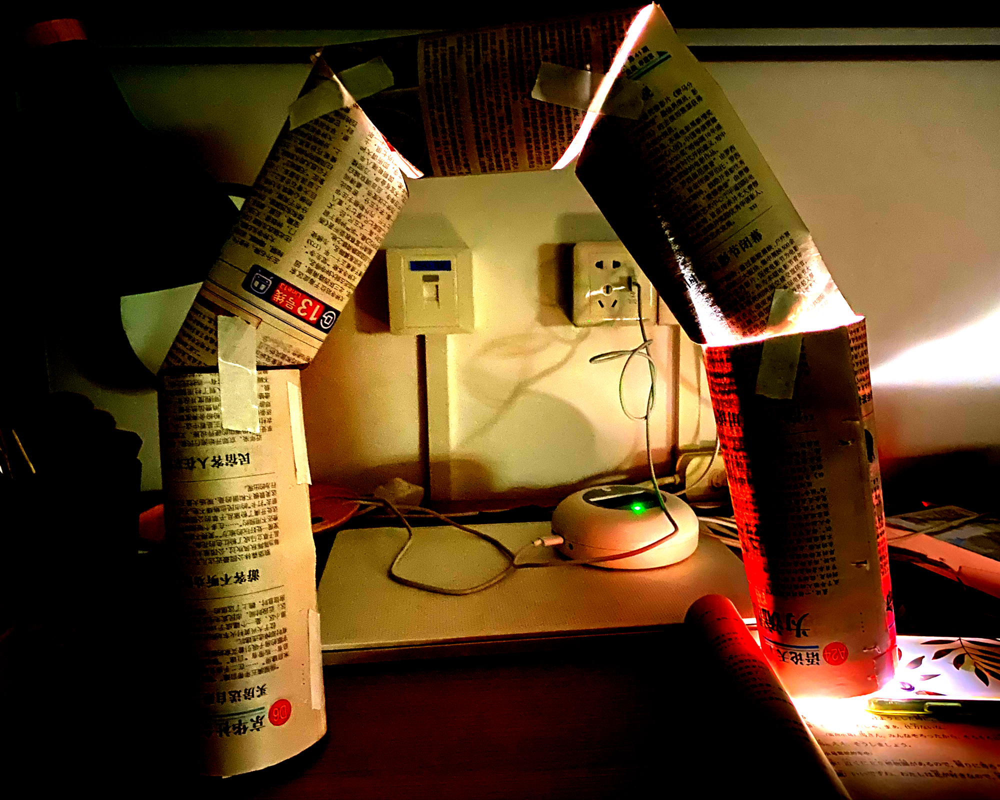
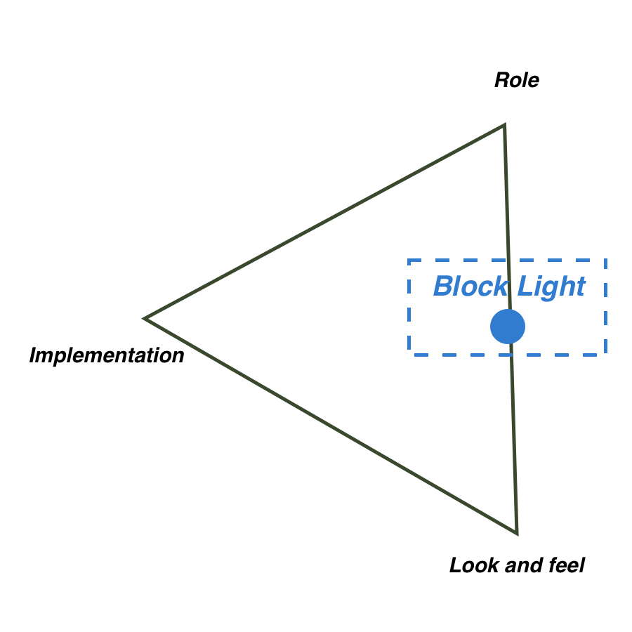

# Block Light

## Inspiration

Today I want to make a lamp prototype. Adjusting light direction is a question already been solved, but this time I want to give a funnier answer. My idea comes from LEGO because I hope my lamp can be dissembled and installed freely.

## Brainstorming

## Prototype

In this prototype, I do not choose to test how each stock can be installed together or taken apart. Also I use the flashlight of smartphone to substitute the built-in lightbulb. I just use newspapers to establish the basic structure and test the light effect in dark room.

