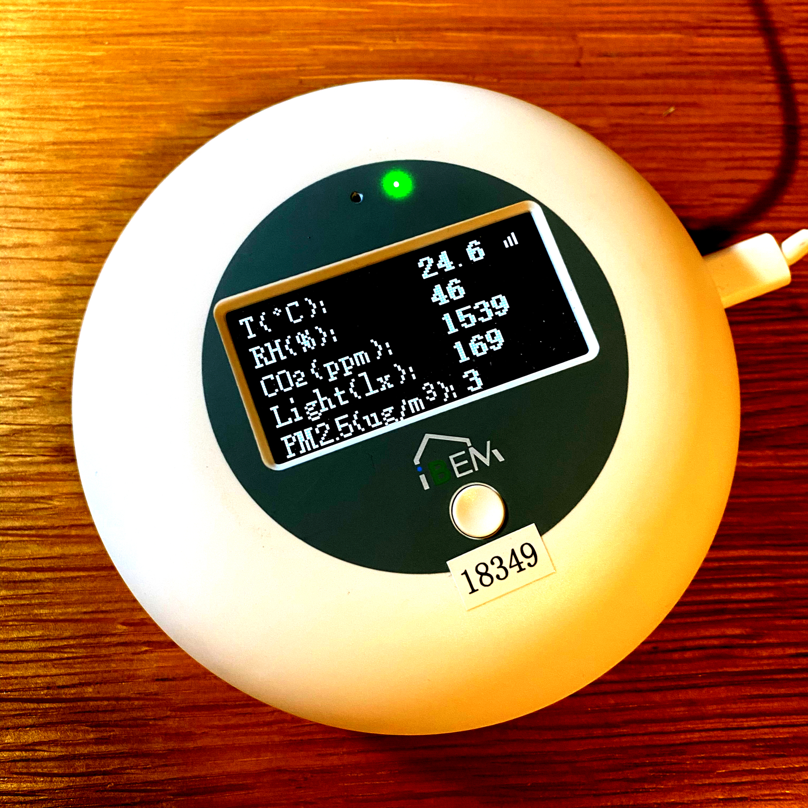
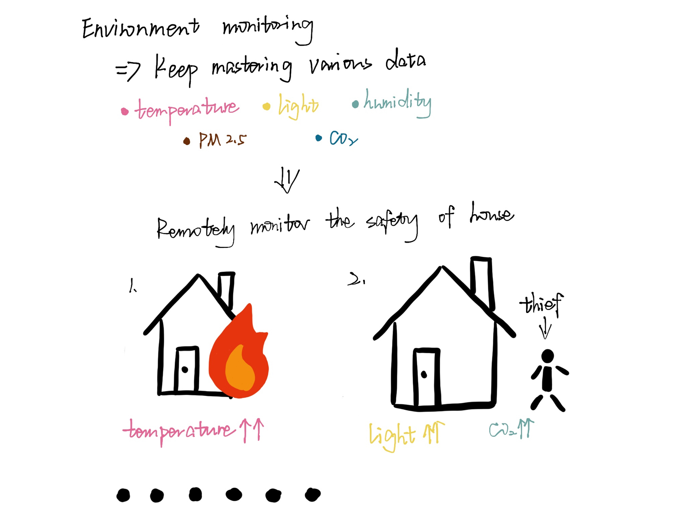
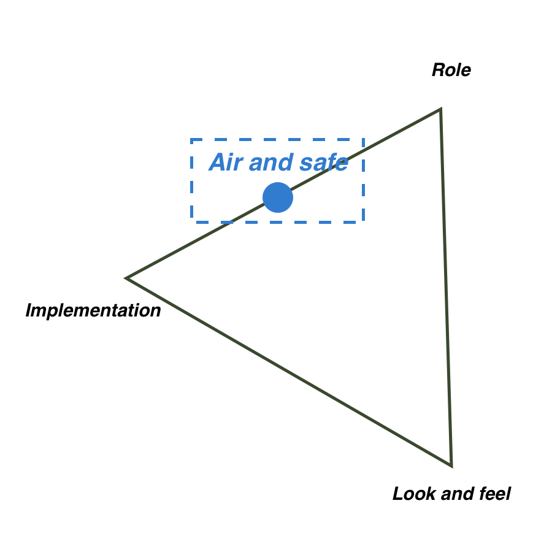

# Air and Safe

## Inspiration

In the context of the COVID-19 epidemic in the world, air quality is something we all start to care about. In one of my selective courses, our professor give us a small device that can be used to record air quality related data every 5 minutes. But I want to explore its usage in a further step.

## Brainstorming

## Prototype

- The general style of user interface is very simple, but roughly shows the core function: monitoring air quality and safety.
- It also shows the technical feasibility, since the device behind is specially developed to record air quality.

