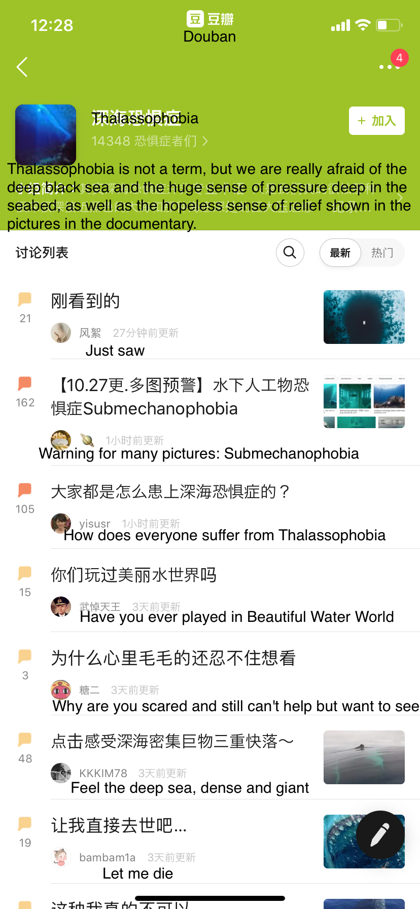

# Thalassophobia

## Inspiration

I have seen a group discussion at Douban (a social platform) about Thalassophobia. They share their common emotion and experience here. But what attract me most is that they still share a lot of pictures about the deep sea even they can cause mental pressure on them.

## Brainstorming

## Prototype

I think that the fear of deep sea comes from unknown. So I use this transparent bottle to build this prototype, to shwo that the unclear part is same as the clear part. This might not be totally true, but just aimed at deepen this cognition.

