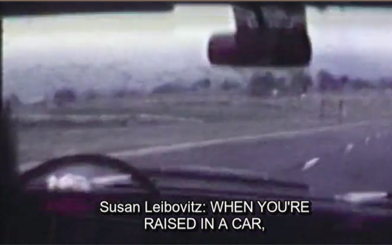
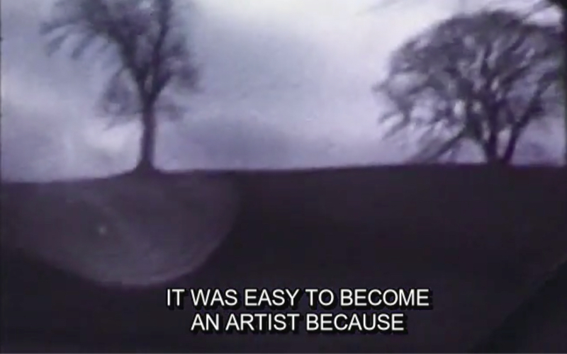
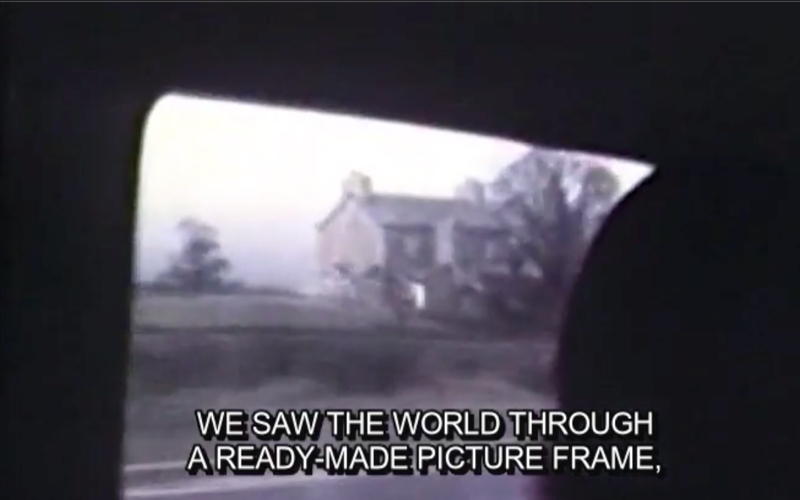
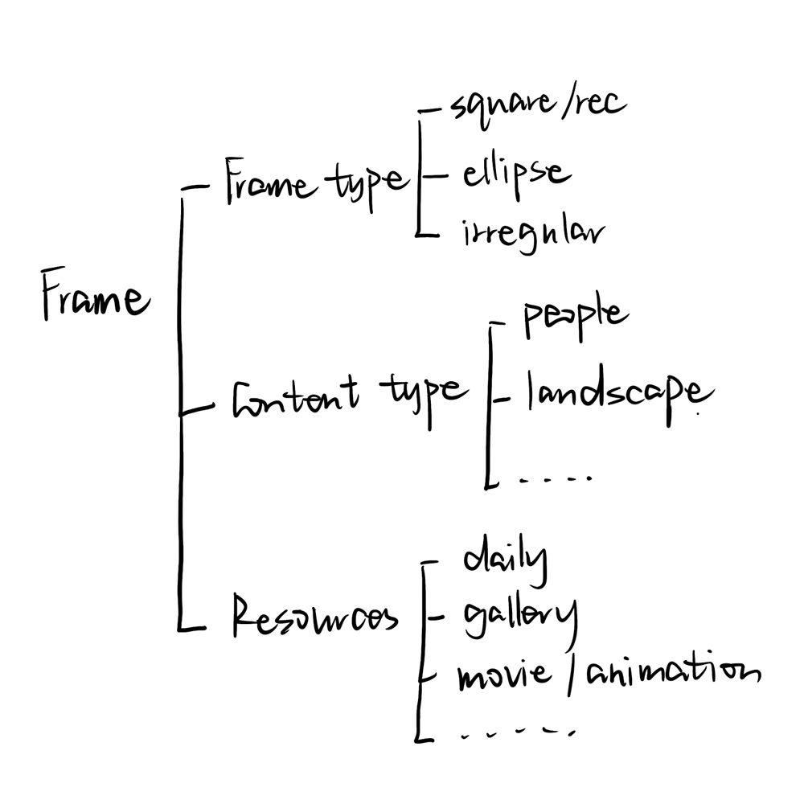
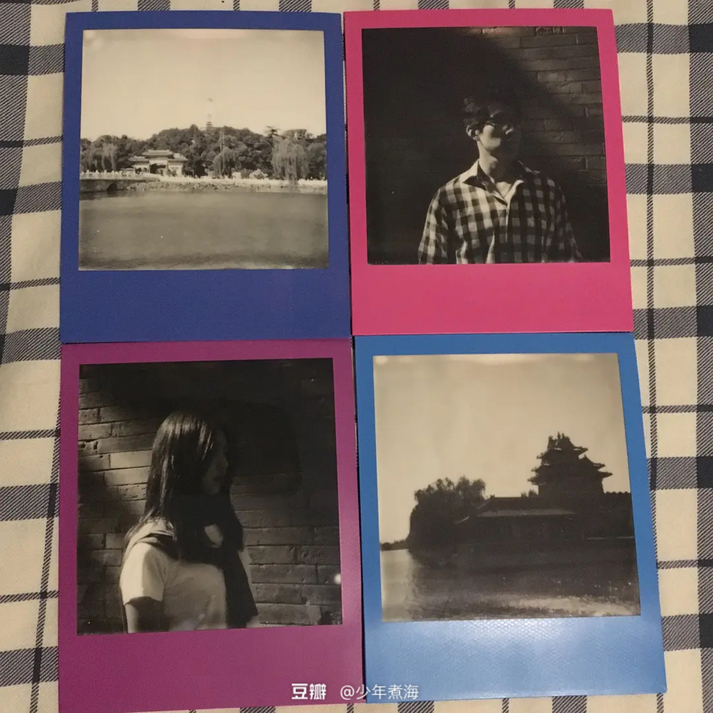
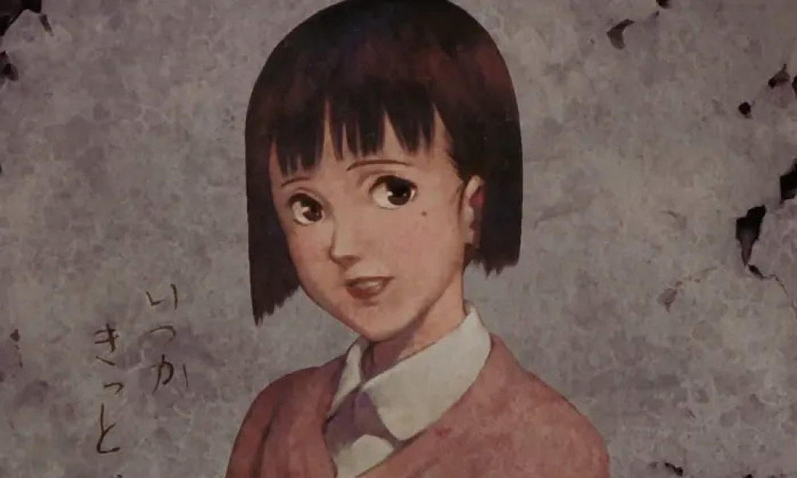
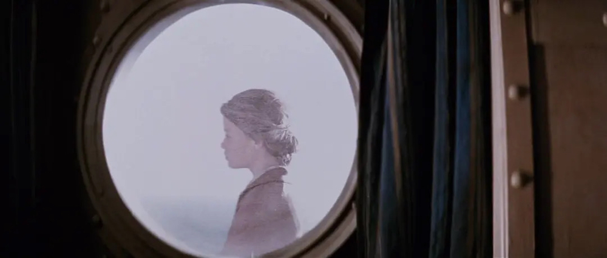
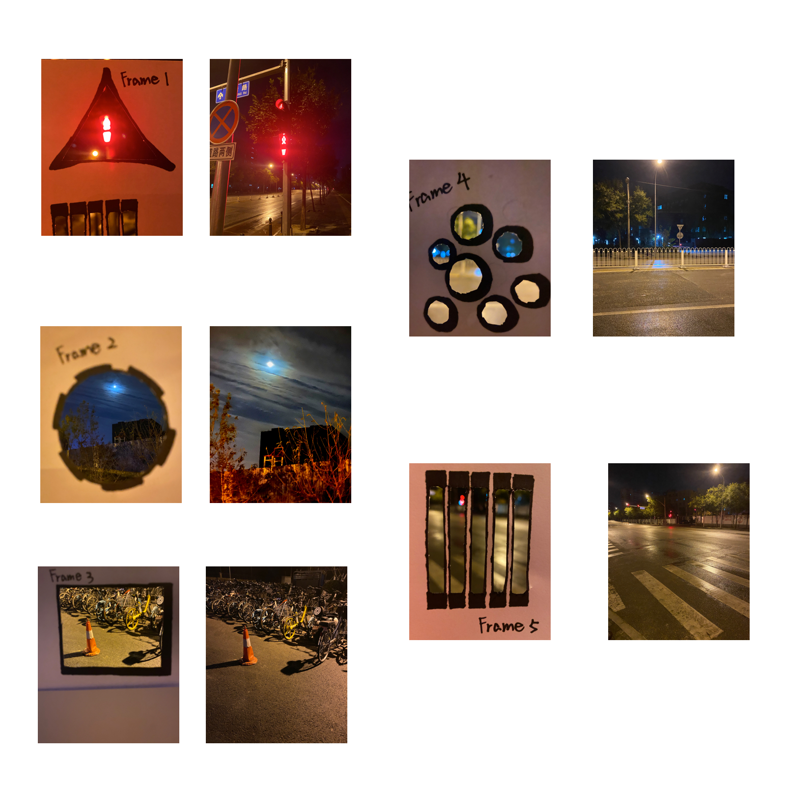
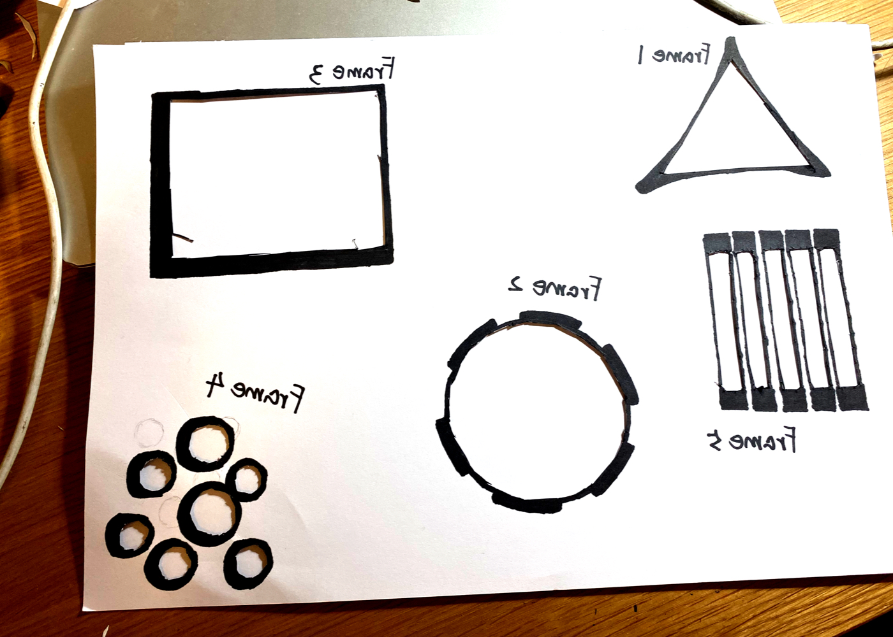
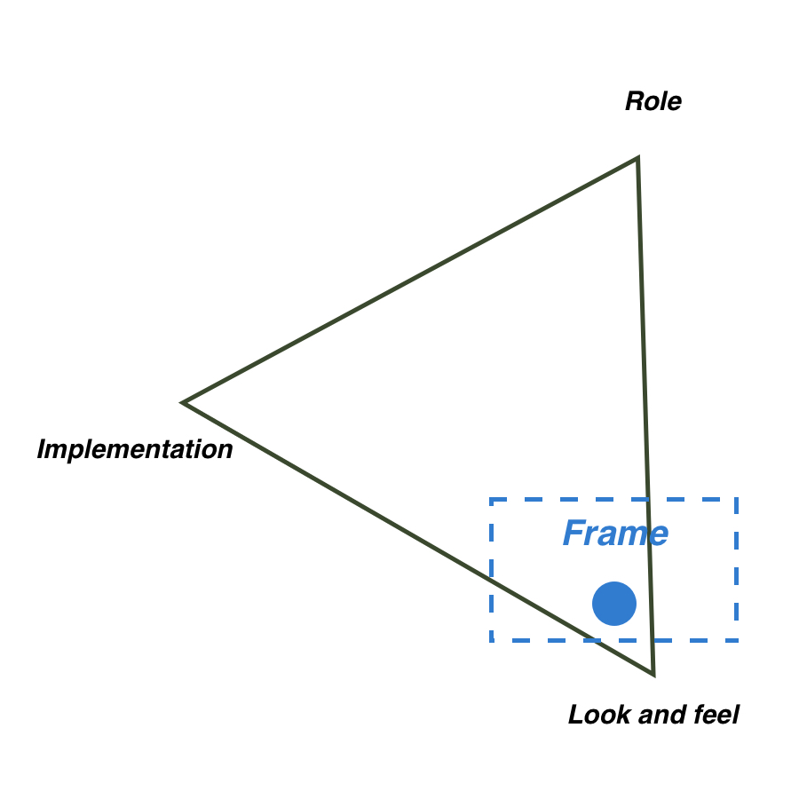

# Frame

## Inspiration

My idea comes from a documentary shared in my writing studio, which is about a famous photographer called Annie Leibovitz. When the interview progresses to the family part, the following paragraph impressed me a lot.

The concept "frame" she mentioned here contributed a lot to her future artistic work. So in this prototype, I want to explore the difference between the world we see through just eyes or a frame.

## Brainstorming

First I want to collect some examples we can see in daily life.

These are photos taken by Polaroid that I saw shared by others. They have their own frames.

This is an episode from “Millennium Actress”, in which the portrait of the heroine is framed exactly on the slate.

This is the classic episode from "The Legend of 1900". In this scene the heroine happened to appear in the box on the cabin. I think this gives the heroine a special beauty.

## Prototype

My prototype is mainly concentrate on comparison between same scene with frame and not with frame, so this is just about feel.

