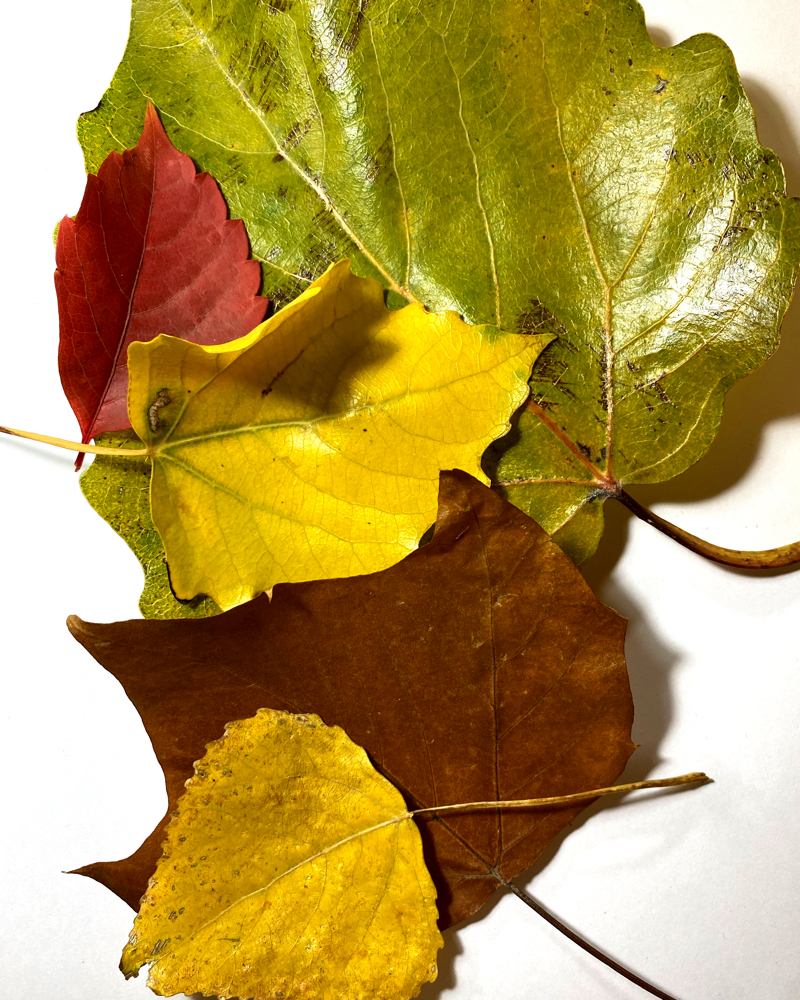
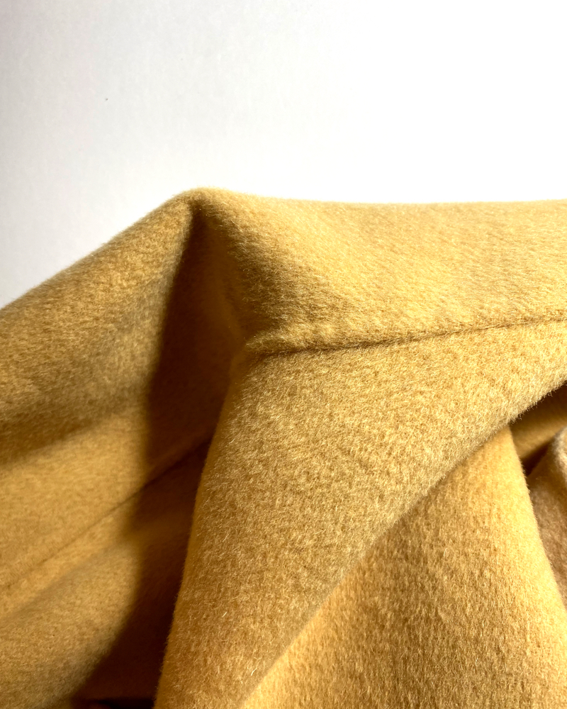
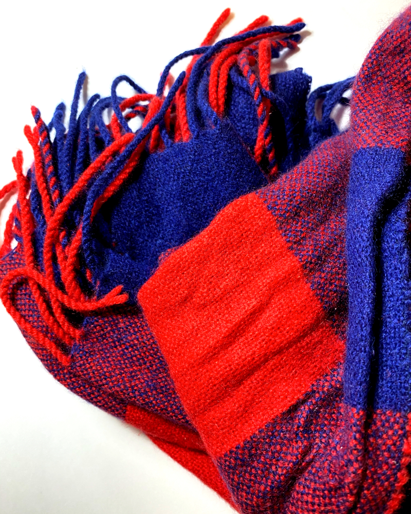
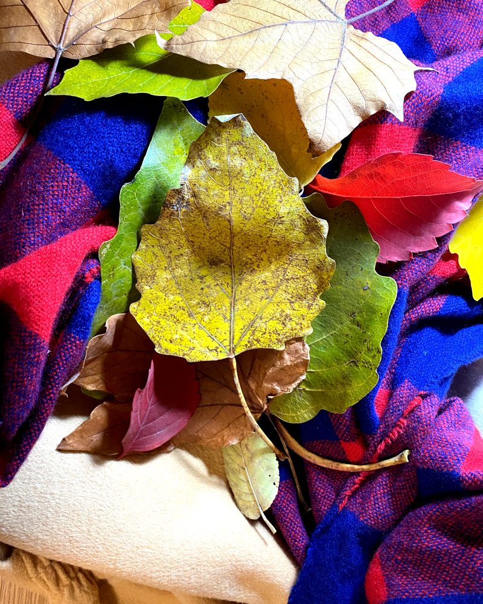
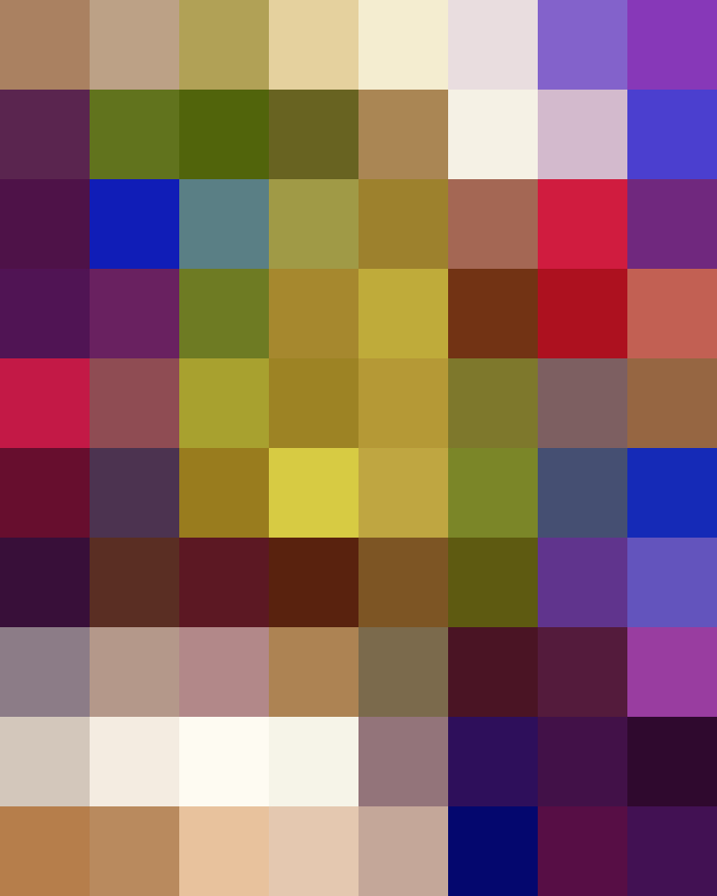
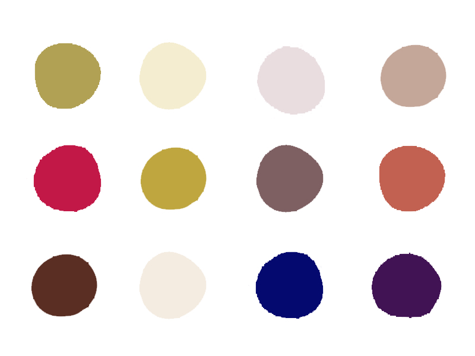

# Autumn Impression

## Inspiration

We recently just entered autumn and it seems that various kinds of commodities start to launch their autumn models: autumn coffee, autumn cake, autumn nails... They are all constituted of autumn elements, like pumpkin and fallen leaves. I think this is more about unique one impression and experience, so I want to make a highly personal one.

## Brainstorming

## Prototype

I picked three items that represent my personal autumn impression：

Every corner of the campus is now full of fallen leaves. Compared to season garbage, I think they are more like decorations.

This is the first coat I will take out of the closet after autumn.

This is the scarf I use most frequently.

I put them together and took a picture.

Mosaic this photo, so that it is easy to extract color.

Now I can get my own autumn color.

