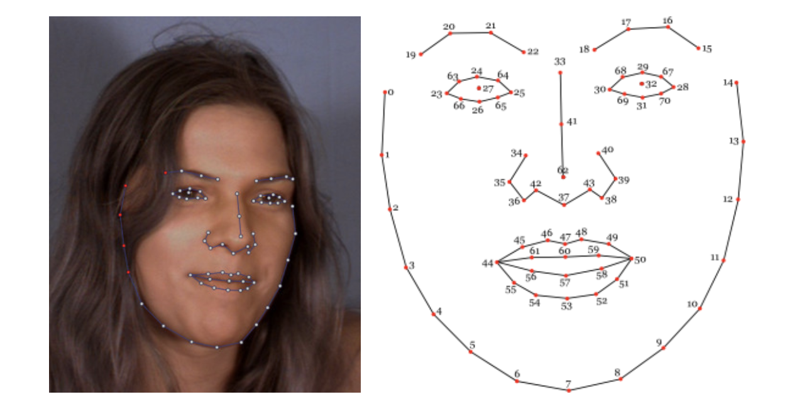

# Digital Prototype Version 3

[Link to my work](https://editor.p5js.org/Jingwen_Zhang/sketches/CIPNNO6-G)

In this version, I made so many big changes and I would like to explain them respectively in the follwoing part:

## Concept

Restricting vision actively when observing a painting is my original goal, since the elements included in one work can be so massive and complex that nothing can leave deep impression on most audiences. Also I want to add some interactions so that audiences can be more immersive.

But after talking with professor, I want to stretch my underlying concept further.

- Information overwhelm
- Comparison and conflicts between the whole and the part
- Comparison and conflicts between group and individual will

## Technique

In my version2 effect1, I use mouse to control the position of the spotlight. Professor Xiang suggest me that using eye view is more natural and can avoid the problem of how to persuade audiences to click on mouse. 

Fortunately in my version2 effect2, I had applied a simple facial recognition technique. So here I combine effect1 and effect2 together, and realize this interaction initially. 

## Artwork

To emphasize my new concept, I change the painting used for demonstration. I need the one with much bigger canvas, more characters and more dramatic scene. It is also better to demonstrate a work with less fame so that audiences cannot guess which one it is before seeing the overall work. 

I initially select *the Derby Day*, from William Powell Frith.
