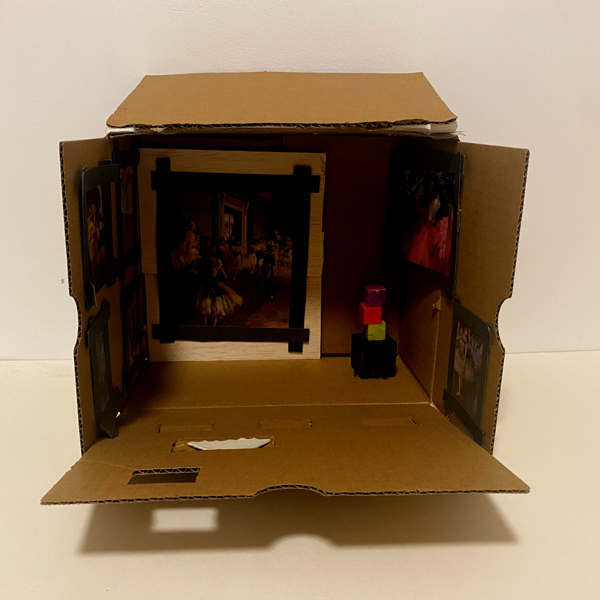
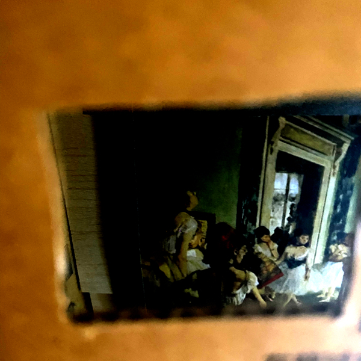
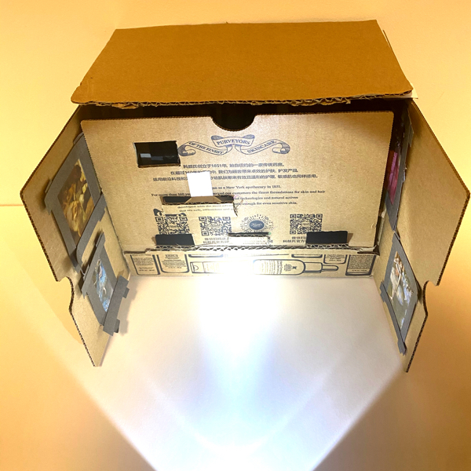

# Pysical Prototype of Final Project

## Photos

I used an express box to build a small art gallery prototype. And I printed out some of Degas works to hang inside. The small objects inside represents a sculpture of Degas, which was made of 4 small blocks.

This is a view of an audience. The gallery is almost closed and she looked in through a small hole. This is the physical prototype of my restriction.

I added different holes at different directions, so that audiences can try to look in through different hole and adjust light direction.

