# Research Report

## Which features of Edgar Degas I want to exhibit

I collect some features of Degas and their corresponding works according to the documentary made by National Gallery of Art called Introduction to the Exhibition - Degas at the Opéra.

- 6:57 He’s thinking very creatively about the experience of the opera. Ballet is just the background. 
*The Ballet from “Robert Le Diable”*
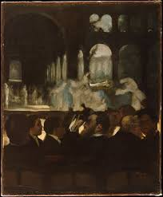

- 13:18 Portrait people at work.
*The Orchestra of the Opera*
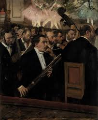

- 19:11 They (ballet dancers) were artists, athletes. They trained and honed and refined their bodies. They were disciplined, controlled and creative. Degas cared about rehearsal scenes because he was more interested in creation process of art.
*The Dance Class*
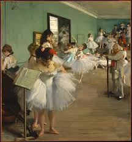

- 21:16 Degas hired ballet dancers to his studio. So his works are combination of reality, memory and imagination. 
*The Rehearsal
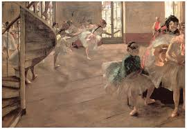

- 27:23 Phantom legs are left because Degas enjoyed playing around with position. He added dancers and continued feeling his way.
*Ballet Rehearsal on Stage
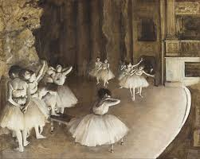

- 32:06 Subscribers of the theatre were added as dark people. 
*The Curtain
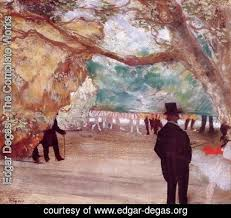

- 37:01 Painting theatre box in the view of woman.
*Study of a Theatre Box
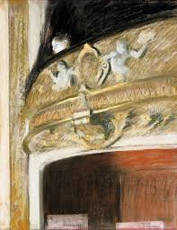

- 38:33 Elongated paintings. Diagonal view track. Same elements appear again and again.
*Dancers in the Rehearsal Room with a Double Bass
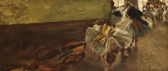

- 41:22 Fan format from Japan. Composition for void and shape
*Fan with Theatre Flat
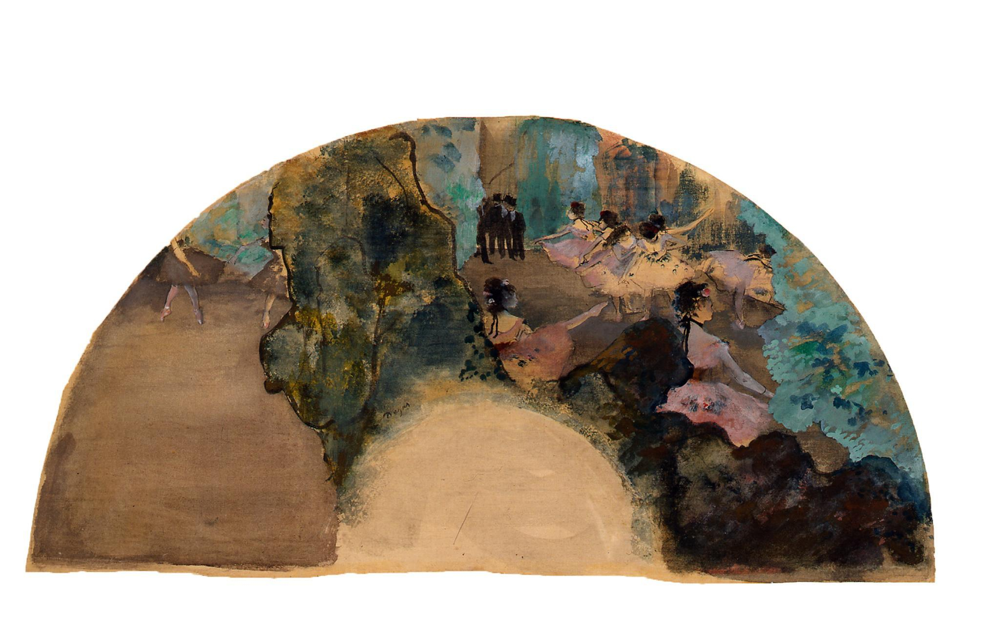

- 51:23 Vibrant, intense and bold color. Outlining.
*Blue Dancers
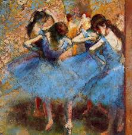

- 52:09 Pastel
*Three Dancers (Blue skirts, red bodices)
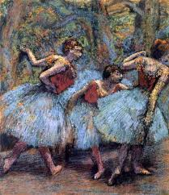

- 1:03:07 Sculpture as Lego
*Little Dancer Aged Fourteen
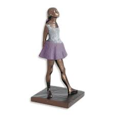

After summarizing and thinking, I mainly want to focus on ballet theme and establish at the Paris opera as the exhibition background image. And the features I plan to concentrate on are composition, repeated elements and subscribers as dark people. 

## Where are the shortcomings of the existing exhibition

Also during the document I find out that those features are the core value of Degas` work, but they are either tiny or obscure. The speakers use light and shadow to help protrude those parts. I experienced the corresponding virtual tour on its official website but I did not saw such process in the physical exhibition. So my next step of research is to find out technique support about applying light and shadow in exact exhibition, rather than just in video.

## What I plan to do to make up for this shortcoming

Then I found out an essay called “The Exhibition Structure and Its Impact Towards Visitors` Understanding at a Museum”, which divides the settings of exhibition structure into 7 aspects: display case, lightning, color, graphics, texts, labels & panels and message flow. 

Some analysis inspire me a lot and I summarize them here:

- Light can set a mood or give a drama.

- Thematic exhibition can apply “black box” affect. Then visitors are encouraged to be attracted by certain elements highlighted with special lighting and color.

- Panels can be incorporated with graphic elements such as photographs, maps, charts and drawing. 

And the author also did research about evaluating exhibition structure in exhibition, and the impact.

## Any precendents?

But more importantly, I want to know more about the existing examples in which light and shadow  play a role in exhibition. I got theoretical support and cases from a book called “Cultures of Light: contemporary trends in museum exhibition.”

In chapter 1 “Light as medium: revealing messages of contemporary light art”, Katzberg asserts that “By utilizing various properties and spectral effects of light, contemporary artists have found new ways to not only express their aesthetic but also to engage the viewer in an immersive viewing experience with an implicitly communicative function”. Here he said that light is not just for environment and background, but also as core carrier and medium of message delivering and interaction with audiences. Then Katzberg adds a theory from Claire Bishop about art installation: the dream scene, heightened perception, mimetic engulfment and activated spectatorship, and analyze light under this theory structure with real cases.

For instance, a work called “Call Waiting” from James Turrell impressed me a lot. The viewers are guided to lie in a cell fulled with homogenous light and most of them can lose sense of balance after staying in this Ganzfeld field for a period. This tests the effect that light can have on physical body.

In chapter4 “In light`s shadow: exhibition shadow-centered media”, I learn a lot about how to utilize shadow and step further in my final design. 

My first important resources here are propositions of Leonardo:

- Attached shadow, which is about shadows and lights envelop opaque bodies.

- Original shadow. It has shadow-emitting property, it has the same value all over and it clings to the object.

- Derived shadow. It derives from other shadow, and attenuate in intensity as being far away from  the origin. 

- Cast shadow. It can manifest itself on same body or different surfaces.

In the paragraph about shadow in modern exhibition, Katzberg concentrates on shadow frame, which happens to accord with my another design concept. So the content here is strongly associated with my ideal final work. 

He first demonstrate that frame is quite useful in controlling audiences` attention and perception by help organize the whole exhibition structure. Based on this idea, light and show frames are supposed to be ideal materials for frame. Because in most environments, where there is light, there will be shadows, which together turn to be double frame.

And in other following cases, Katzberg remind me not to forget about adjusting the size of shadow and applying the relative metaphors behind light and shadow. Especially when you need to use light and shadow to embody the space and distance, casting a much bigger or smaller shadow can have much better effects. As for the demotion and connotation role, Katzberg use a work called Air-Launched Anti-Radar Missile for explanation and discussion. In this context, the concepts of light as peace and shadow as war are embedded in. 
